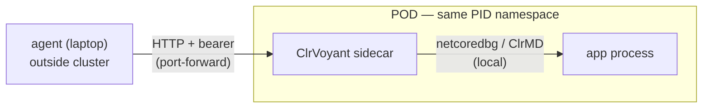

# Remote debugging in a POD

ClrVoyant can run **inside a Kubernetes POD** as a sidecar so an agent can debug a
.NET app running in the cluster. This was de-risked by the Linux spike
([../spike/linux/FINDINGS.md](../spike/linux/FINDINGS.md)).

## What "remote" means here

Only the **agent ↔ server** link is remote (over HTTP). The debug engine is
**local** to the target:

```
  agent (laptop)  ──HTTP + bearer──►  ClrVoyant sidecar  ──netcoredbg/ClrMD──►  app process
  (outside cluster)   port-forward       (in the POD)        (same POD, same PID ns)
```



netcoredbg and ClrMD have no network attach — they read the app process locally.
So ClrVoyant must be **co-located with the app** (sidecar in the same POD, sharing
the PID namespace). HTTP transport is what lets the agent reach it from outside.

## Pieces

- **[Dockerfile](Dockerfile)** — builds the Linux image: publishes the server and
  bundles the architecture-matching `netcoredbg` (linux-x64, or linux-arm64 when
  built with `docker buildx build --platform linux/arm64`). HTTP transport; no
  token baked in.
- **[clrvoyant-sidecar.yaml](clrvoyant-sidecar.yaml)** — a Deployment with
  `shareProcessNamespace: true`, the app container, and the ClrVoyant sidecar with
  `CAP_SYS_PTRACE` and the auth token from a Secret.

## Requirements

1. **PDBs in the app image** — without `.pdb` files you get no source lines or
   locals (only native/IL-level). Ship a debug-friendly image.
2. **`CAP_SYS_PTRACE`** on the sidecar — netcoredbg attaches via ptrace and ClrMD
   reads `/proc/<pid>/mem`. Hardened clusters drop this by default; it must be
   added (see the manifest). `shareProcessNamespace: true` is also required.
3. **Same architecture + .NET 8+** for app and sidecar. The sidecar image must
   match the node/app architecture (`linux-x64` or `linux-arm64`) — the engine
   debugs locally and cannot cross architectures. Build the arm64 image with
   `docker buildx build --platform linux/arm64 -f deploy/Dockerfile .`.

## Connect an agent

```sh
# 1) Build & push the image
docker build -t your-registry/clrvoyant:latest -f deploy/Dockerfile .
docker push your-registry/clrvoyant:latest

# 2) Set a strong token in the Secret, then apply
kubectl apply -f deploy/clrvoyant-sidecar.yaml

# 3) Forward the MCP port (keep it cluster-internal — no public Ingress)
kubectl port-forward deploy/my-app-with-debugger 3001:3001
```

Point your MCP client at the HTTP endpoint with the bearer token:

```json
{
  "mcpServers": {
    "clrvoyant-pod": {
      "type": "http",
      "url": "http://127.0.0.1:3001",
      "headers": { "Authorization": "Bearer <the-secret-token>" }
    }
  }
}
```

Then have the agent **attach to the app process**: in the shared PID namespace the
app is visible from the sidecar, so the agent calls `list_processes()` to find the
app's pid and `debug_attach(<pid>)` to attach to it. From there `set_breakpoint`,
`continue`, `list_tasks`, etc. behave exactly as locally. Enabling
`set_auto_attach(true)` makes the sidecar discover .NET children via `/proc` too.

## Security posture (read before deploying)

An authenticated caller can attach a debugger, set breakpoints, and **evaluate
code** in the app process — i.e. arbitrary code execution in that POD. Therefore:

- The server **fails closed**: HTTP refuses to start without `CLRVOYANT_AUTH_TOKEN`.
- Keep the endpoint **cluster-internal** (ClusterIP + `port-forward`, or mTLS).
  Do **not** expose it via a public Service/Ingress.
- Treat this as a **break-glass / non-prod** capability; rotate the token, and use
  a `NetworkPolicy` to restrict who can reach port 3001.
