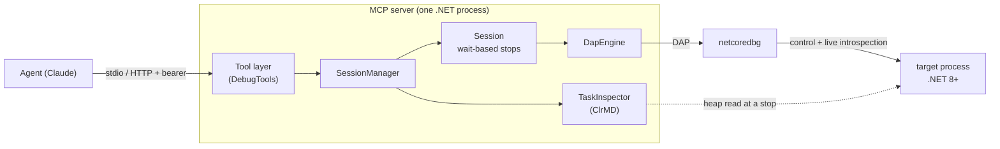

# Architecture (as built)

This describes ClrVoyant **as it is now**. For the original phased plan see
[IMPLEMENTATION_PLAN.md](IMPLEMENTATION_PLAN.md); for *why* the big decisions were
made see the [ADRs](adr/README.md).

## Overview

ClrVoyant is a single .NET process: an **MCP server** that lets an agent debug .NET
8/9/10 apps headlessly. It orchestrates **two engines** against a target, behind
**one IDE-neutral tool contract** ([ADR-0002](adr/0002-two-engines-one-contract.md)):

- **netcoredbg over DAP** — control + live introspection (breakpoints, step,
  threads, call stack, variables, evaluate).
- **ClrMD** — reads the heap at a stop to enumerate `Task`s and reconstruct the
  async await/continuation graph (the "Tasks window" DAP cannot provide).

## Projects

| Project | Responsibility |
|---|---|
| `ClrVoyant.Core` | Models/DTOs, `IDebugEngine`, `Session`, `SessionManager`, `BreakpointLocator`. No engine or FS specifics — pure, testable. |
| `ClrVoyant.Dap` | `DapClient` (DAP framing, request/response correlation, event pump) + `DapEngine` (`IDebugEngine` over netcoredbg). |
| `ClrVoyant.Inspection` | `TaskInspector` — ClrMD heap read, Task status decoding, async-state-machine walking, graph reconstruction. `AssemblyMethodScanner` — static metadata read for no-source method discovery. |
| `ClrVoyant.Server` | MCP host: tool surface (`DebugTools`), transports (stdio/HTTP), DI wiring (`HostFactory`), `NetcoredbgLocator` (per-RID/flat bundle) + `NetcoredbgFetcher` (fallback per-OS/arch engine fetch), `ChildProcessWatcher`, `ProcessLister`, `TestDebugLauncher`. |
| `tools/netcoredbg` | Bundled engine, all RIDs in the package ([ADR-0006](adr/0006-bundle-netcoredbg.md)). |
| `samples/SampleApp`, `samples/ParentApp` | Targets for tests/demos. |
| `spike/` | The de-risking proofs (Windows coexistence, and `spike/linux/` for the Linux/POD risk). |

## Key designs

### Wait-based execution ([ADR-0004](adr/0004-wait-based-execution-model.md))
`continue`/`step_*` block until the next stop (or exit/timeout) and return the new
location. A resume arms a *targeted waiter*; the next stop completes it. A stop with
no waiter (idle breakpoint, `stopAtEntry`) is *spontaneous* and fans into
`wait_for_any_stop`. The agent sees `continue → "stopped at Foo.cs:42" → inspect`.

### Multi-session ([ADR-0005](adr/0005-multi-session-from-the-start.md))
`SessionManager` owns many `Session`s; every session-scoped tool takes an optional
`sessionId` (defaults to the active/most-recently-stopped). `wait_for_any_stop`
reports which session broke.

### Two identity spaces
DAP handles (`frameId`, `variablesReference`) are invalidated on every continue;
ClrMD addresses are valid within a heap read. Both are scoped to a stop: `Session`
bumps a `StopId` on every stop, and the ClrMD read is cached per `(pid, StopId)` so
`list_tasks` + `get_async_graph` + `get_task` at one stop read the heap once.

### Breakpoint store
DAP `setBreakpoints` *replaces* all breakpoints for a file, so `Session` keeps the
desired set per file and assigns stable ids, re-sending the full set on each change.
`set_breakpoint` can resolve a line by **source text** (`content`) via
`BreakpointLocator`, robust to line drift.

### Cross-OS heap read ([ADR-0008](adr/0008-cross-os-heap-read.md))
`TaskInspector.OpenDataTarget`: Windows → PSS snapshot
(`CreateSnapshotAndAttach`); Linux → passive read (`AttachToProcess(suspend:false)`,
read-only `/proc/<pid>/mem`, no second ptrace stop). Proven to coexist with
netcoredbg holding the process.

### Transports ([ADR-0009](adr/0009-http-transport-mandatory-auth.md))
`HostFactory.RunAsync` selects by `CLRVOYANT_TRANSPORT`:
- **stdio** (default): console host, logging to stderr (stdout is the JSON-RPC
  stream).
- **http**: ASP.NET Core `WebApplication` + `MapMcp()`, mandatory bearer token,
  fails closed without one. For the POD topology see
  [remote-debugging-pod.md](remote-debugging-pod.md).

## Notable gotchas (learned, encoded in the code)

- Breakpoint source paths must be full OS paths (`Path.GetFullPath`) to match the PDB.
- Debug builds emit async state machines as a **class**, Release as a **struct** —
  ClrMD awaiter walking tries both (`ReadObjectField` then `ReadValueTypeField`).
- netcoredbg often returns `verified=false` then binds asynchronously via a
  `breakpoint` event; `set_breakpoint` waits briefly for the verified flip.
- netcoredbg's `pause` on a freely-running target is unreliable; the wait-based
  model and breakpoints are the deterministic path.
- async-state-machine line breakpoints can be flaky on netcoredbg; synchronous,
  repeatedly-executed lines bind reliably (matters mainly for spikes/tests).

## Where to go next

- Tool reference: [tools.md](tools.md)
- Security model: [security.md](security.md)
- Tests: [testing.md](testing.md)
- POD/remote: [remote-debugging-pod.md](remote-debugging-pod.md)
