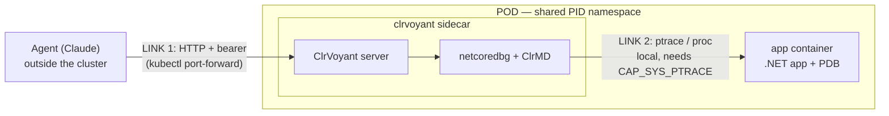

# Remote debugging in Docker / Kubernetes

How ClrVoyant lets an agent debug a .NET app running in a container or POD. This is
the conceptual/architecture guide; the operational quickstart (commands, manifest,
image) lives in [`deploy/`](../deploy/README.md).

Decisions behind this: [ADR-0009](adr/0009-http-transport-mandatory-auth.md)
(HTTP+auth), [ADR-0010](adr/0010-pod-remote-debug-topology.md) (sidecar topology),
[ADR-0008](adr/0008-cross-os-heap-read.md) (Linux heap read). The risk was
de-risked by the Linux spike (`spike/linux/FINDINGS.md`).

## The one idea to get right: two separate links



1. **Agent → MCP server** — over **HTTP** (with a bearer token). This is the link
   HTTP transport unlocks: the agent is on your laptop, the server is in the cluster.
2. **Server → debugged process** — netcoredbg and ClrMD have **no network attach**.
   They read the process *locally* via kernel facilities (`ptrace`, `/proc`). So
   ClrVoyant must live **in the same POD** as the app.

Takeaway: **HTTP makes only the agent remote. The engine stays glued to the app.**
That is why the deployment is a sidecar — not ClrVoyant somewhere else reaching in.

## Why sidecar + shareProcessNamespace + SYS_PTRACE

By default each container in a POD has its **own PID namespace**: the sidecar would
not see the app's process at all. Three ingredients fix that:

| Ingredient | Why |
|---|---|
| `shareProcessNamespace: true` | One POD-wide PID namespace, so the sidecar sees the app in `/proc` (this is what makes `list_processes` work). |
| `CAP_SYS_PTRACE` on the sidecar | Lets netcoredbg attach (ptrace) and ClrMD read `/proc/<pid>/mem` of a process it doesn't own. Hardened clusters drop it by default. |
| **PDBs in the app image** | Without `.pdb` there is no line↔IL map: no source breakpoints, no local variable names. The app image must be debug-friendly. |

## End-to-end flow

### A. Build the image — [`deploy/Dockerfile`](../deploy/Dockerfile)
- `sdk` stage: `dotnet publish` the server. Publish stages netcoredbg for **all
  supported RIDs** under `/app/tools/netcoredbg/<rid>/` (downloaded + SHA-256
  verified at publish time with built-in MSBuild tasks).
- `aspnet` runtime stage (HTTP needs the ASP.NET shared framework): copies the
  publish output and `chmod +x` the Linux launcher(s) — **no download here**.
  `NetcoredbgLocator` then picks the image's RID. Build arm64 with
  `docker buildx build --platform linux/arm64`.
- Sets `CLRVOYANT_TRANSPORT=http` and `CLRVOYANT_HTTP_URL=http://0.0.0.0:3001`. The
  **token is not baked in** — the server fails closed without `CLRVOYANT_AUTH_TOKEN`.

### B. Deploy — [`deploy/clrvoyant-sidecar.yaml`](../deploy/clrvoyant-sidecar.yaml)
A `Deployment` with `shareProcessNamespace: true`, the `app` container and the
`clrvoyant` sidecar (token from a `Secret`, `SYS_PTRACE` added), plus a ClusterIP
`Service`.

### C. Connect the agent
```sh
kubectl port-forward deploy/my-app-with-debugger 3001:3001
```
```json
{ "mcpServers": { "clrvoyant-pod": {
    "type": "http",
    "url": "http://127.0.0.1:3001",
    "headers": { "Authorization": "Bearer <token>" }
}}}
```
The bearer middleware rejects anything without the right token with `401`.

### D. The debug session (what the agent does)
1. `list_processes()` — sees processes in the shared PID namespace; finds the app's
   PID.
2. `debug_attach(<pid>)` — **netcoredbg ptrace-attaches** the app and becomes the
   controller (can stop it, set breakpoints, step).
3. `set_breakpoint`, `continue`, `get_callstack`, `get_variables`, … — exactly as
   local.
4. `list_tasks` / `get_async_graph` — **ClrMD reads the heap passively**
   (`/proc/<pid>/mem`, read-only) *while netcoredbg holds the process*. That
   coexistence is the spike's key result: netcoredbg uses ICorDebug, not an
   exclusive ptrace lock, so the passive read does not contend.

## The two-engine coexistence on Linux (the technical heart)

On Windows ClrMD takes a PSS snapshot (a frozen copy). That API is Windows-only,
and Linux allows only one ptrace tracer per process — which netcoredbg already is.
The fear was that ClrMD couldn't read while netcoredbg held the process. The Linux
spike proved otherwise: the production path — `AttachToProcess(suspend:false)`, a
read-only `/proc/<pid>/mem` read with **no second ptrace stop** — coexists cleanly
(see [ADR-0008](adr/0008-cross-os-heap-read.md) and `spike/linux/FINDINGS.md`).

## Security (read before deploying)

An authenticated caller can attach a debugger and **`evaluate` code** in the app
process — i.e. arbitrary code execution in that POD. Therefore:

- The server **fails closed** (no token → won't start).
- Keep the endpoint **cluster-internal**: ClusterIP + `port-forward` (or mTLS at an
  ingress). **Never** a public Service/Ingress.
- Treat it as **break-glass / non-prod**: rotate the token, restrict reach to port
  3001 with a `NetworkPolicy`.

Full threat model: [docs/security.md](security.md).

## Local-only Docker (no Kubernetes)

The same image runs as a plain container if you just want HTTP transport locally:
```sh
docker run --rm -e CLRVOYANT_AUTH_TOKEN=secret -p 3001:3001 \
  --cap-add=SYS_PTRACE clrvoyant:latest
```
Debugging a process in *another* container still requires sharing a PID namespace
(`--pid=container:<id>`) and `SYS_PTRACE`, mirroring the POD model.
